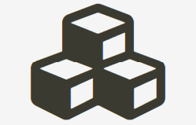
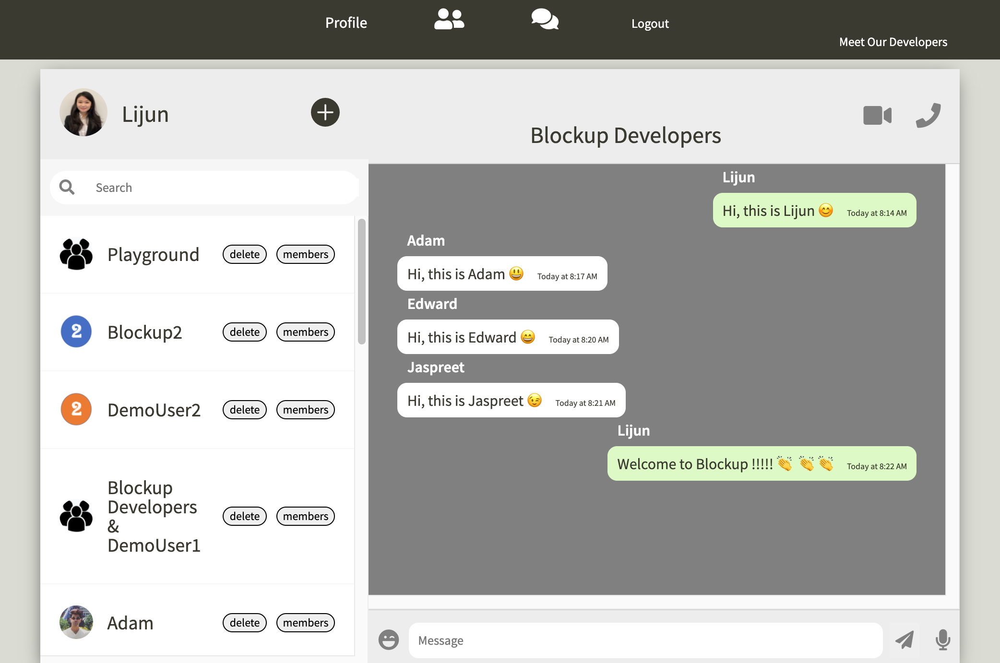

# 
   Block     Up  

Blockup is a communication app built with the MERN stack (MongoDB | Express | React | Node.js) and hosted on Heroku. Technologies include: two factor authentication, AWS S3, WebRTC, Web Speech, Socket.IO, MongoDB, Mongoose, Express.js, React, Redux, Node.js, HTML5, CSS, Webpack, Heroku, Git, and Github.

# 
 [Check Out the Live App!][1] 

## Live Messaging

## Video Chat

## Adding friends

## Upload profile picture

[1]: https://blockup.herokuapp.com/#/