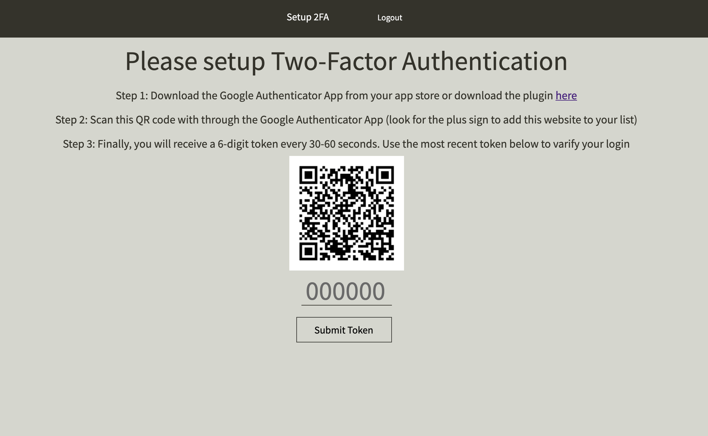

# <p align="center">   Block     Up  </p>


Blockup is a communication app built with the MERN stack (MongoDB | Express | React | Node.js) and hosted on Heroku. Technologies include: two factor authentication, AWS S3, WebRTC, Web Speech, Socket.IO, MongoDB, Mongoose, Express.js, React, Redux, Node.js, HTML5, CSS, JavaScript, Webpack, Heroku, Git, and Github.

# <p align="center"> [Check Out the Live App!][1] </p>

## Two-Factor Authentication


Blockup adds an extra layer of security to users' account by implement Two-factor authentication — an additional login step — to prevent someone from logging in even if they have access to users' password.


```js

//twofapassport.js 

      function (user, done) {

        if (!user.verified) {
          done(new Error("Google Authenticator is not setup yet."));
        } else {

          var secret = GoogleAuthenticator.decodeSecret(user.secret);
          done(null, secret, 30);
        }
      }

```
## Friending


Blockup users are able to sent friend request and receive friend request to other blockup users. After the friend request is send, the friend request receiver will get a friend request notification instantly. The two-people room will created after the receiver accept the friend request.  Also. the receiver can cancel the requests they received, and the sender can cancel the requests they sent.

The friends page shows the list of the user's friends with their username, profile pictures, and the most recent message between them. Users can enter the two-peopele room on the friends page and able to unfriend with their friends. However, the the two-peopele room will be deleted once these two people are unfriended. 

```js

//friendship.jsx 

  acceptRequest(friendRequest){
    return ()=>{
      this.props.deleteFriendRequest(friendRequest._id)
      .then(()=>{
        this.props.createFriendship(
        {friend1: friendRequest.senderId._id , 
        friend2: friendRequest.receiverId._id})}).then(()=>{

          this.socket.emit("accepted friend request", {receiver_id: this.props.user.id, sender_id: friendRequest.senderId._id});
          
          const rooms = Object.values(this.props.rooms).filter((ele)=>{

            return (ele.members.length === 2 && ele.members.every(member => [friendRequest.senderId._id , friendRequest.receiverId._id].includes(member._id)))
          })
  
          if(rooms.length === 0){
            const user = {
                id: friendRequest.receiverId._id,
                username: friendRequest.receiverId.username
                };
            const room = {
                name: friendRequest.senderId.username + " & " +  friendRequest.receiverId.username,
                user: user,
                members: [{_id: friendRequest.senderId._id} ]
                };

            this.props.createRoom(room).then(()=>{
                this.socket.emit("create room",[friendRequest.senderId._id]);
                }).then(()=>{
            this.props.fetchUserRooms(this.props.user.id)
                })
            }
        })
    }
  }


```

## Mutiple Chat Rooms


Blockup provides users a convenient way to create mutiple chat rooms with their friends. Once the room is created, anyone belongs to the room is able to check the room members, send messages, join video chat, join voice chat and delete the room.

```js

//side_room_item.js 

    const room = this.props.rooms.filter((room)=> room._id ===id)[0]
      const roomMembers =[]

      this.props.destroyRoom(id).then(()=> {
        
        room.members.forEach((member)=>{
            if(member._id !== this.props.user.id){
              roomMembers.push(member._id)
              }
          })
     
        this.socket.emit("delete room", {members: roomMembers, roomId: id});

        if(this.props.rooms.length > 1){
          
          let setRoom = this.props.rooms.slice(-1)[0]._id === id ? this.props.rooms.slice(-2)[0]._id : this.props.rooms.slice(-1)[0]._id
            
          this.props.setActiveRoom(setRoom ).then(()=>{
            this.props.fetchRoomMessages(setRoom)
            const ele = document.getElementById(id + "roomId");
            if(ele){
                ele.style.display = "none";
              }
            })
        }else{
          this.props.resetActiveRoom();
        }
        this.closeModal(id)();
      })

```


## Live Messaging


Blockup allows users to send live text message and emoji. In addtion, by utilizing web speech api, Blockup provides users to record their vioce and convert it to text, so users can send their live voice to text messages.

```js

//chat_box.js 

  handleIsListen(){
    this.mic.start()

    this.mic.onend = () => {
      console.log('continue...')
      this.mic.start()
    }
 
    this.mic.onresult = event => {
      const transcript = Array.from(event.results)
        .map(result => result[0])
        .map(result => result.transcript)
        .join('')
  
      this.setState({ content: transcript })
    }
    
    this.setState({isListening: !this.state.isListening})
  }

```


## Video/Audio Chat 


Blockup users can join/exit the video chat or voice chat whenever they want. 

```js

//video_chat.jsx 

 this.myPeer.on('call', call => {
          
          this.peers[call.peer] = call
          call.answer(stream)

          const video = document.createElement('video')
        
          call.on('stream', userVideoStream => {
            this.addVideoStream(video, userVideoStream,call.peer)
          })

          call.on('close', () => {
            video.remove()
            
            if(document.getElementById(call.peer)){
              document.getElementById(call.peer).remove();
            }
          })
        })

```


## Profile Picture Uploading


Blockup allows users to upload/change their profile pictures to AWS S3.


[1]: https://blockup.herokuapp.com/#/